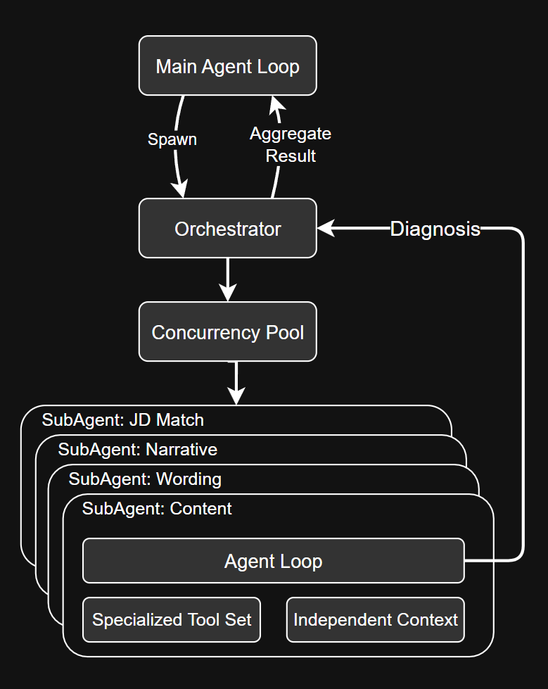

# ResumePilot

A light weight resume improving agent, which diagnoses resume bullets and give analysis from 5 perspectives (Content depth, Wording, Career Narrative, Format, and optional JD match).

ResumePilot features with agent loop, tool dispatch, stream parsing, context compaction, sub-agent orchestration and permission gate. No LangChain, no LangGraph, no ORM.

## Features

- **Sourced, not vibe** — checked against published guidance that can be cited: Google's XYZ formula, Harvard FAS resume rules, and FAANG bullet conventions.

- **Rewrites you can act on** — placeholders say what to go and find, `[% smaller than the FP16 baseline]` rather than `[X]`, plus a version for when the number does not exist.

- **Sensitive information stay out** — they never reach a diagnosis agent and never appear in the report, pinned by tests.

- **Resumable** — checkpoints as it goes, so a dropped connection costs the last entries rather than the run.

- **Specialised sub-agents** — each is a miniature agent loop of its own: its own system prompt, its own subset of the tools, its own context window.

- **Decoupled Structure** — backend (routing, retry, rate limiting, caching, budgeting, accounting) are decoupled with frontend `query()`.

- **Governed by construction** — every tool call passes a permission gate and a budget check; long-term memory is written from one hook and nowhere else.

- **Token efficient** — prompt caching on the shared system prefix, plus per-role routing that keeps cheap work off the expensive model.

- **Costs** — with `deepseek-v4-flash`, about 36 calls and ~$0.31 per resume.

## Architecture



The orchestrator fans one resume out to four roles — substance and wording per entry, narrative and JD match once per document — and their results compose into one report.

## Environment

Node.js >= 22.12, pnpm, and one provider API key.

**macOS**

```bash
brew install node pnpm
```

**Linux**

```bash
curl -fsSL https://deb.nodesource.com/setup_22.x | sudo -E bash - && sudo apt install -y nodejs
npm install -g pnpm
```

**Windows** (PowerShell as administrator — `better-sqlite3` builds from source)

```powershell
winget install OpenJS.NodeJS.LTS Microsoft.VisualStudio.2022.BuildTools
npm install -g pnpm
```

<details>
<summary>Homebrew: two pitfalls</summary>

`node@24` is keg-only and is not linked into `bin/`:

```bash
export PATH="$(brew --prefix)/opt/node@24/bin:$PATH"
```

Homebrew builds Node against its own `openssl@3`. If that formula's post-install step failed, `pnpm install` reports `UNABLE_TO_GET_ISSUER_CERT_LOCALLY` — `brew postinstall openssl@3` restores the missing `cert.pem` symlink.

</details>

## Quick start

```bash
git clone https://github.com/SeanHe727/ResumePilot.git && cd ResumePilot
pnpm install
cp .env.example .env      # one provider key is enough
pnpm build-kb             # 46 corpus entries + embeddings, ~$0.0003
```

Then diagnose something:

```bash
pnpm diagnose resume.pdf                       # non-interactive, prints the report
pnpm diagnose resume.pdf --jd posting.txt      # also score coverage against the posting
pnpm diagnose resume.pdf --fast                # deterministic pipeline, five calls
pnpm start resume.pdf                          # interactive session
```

Reads `.pdf`, `.docx`, `.md` and `.txt`. In a session, `/help` lists the commands — `/diagnose`, `/detail <n>`, `/export md|json`, `/continue`, `/status` and the rest.

```bash
pnpm test
pnpm typecheck
```
